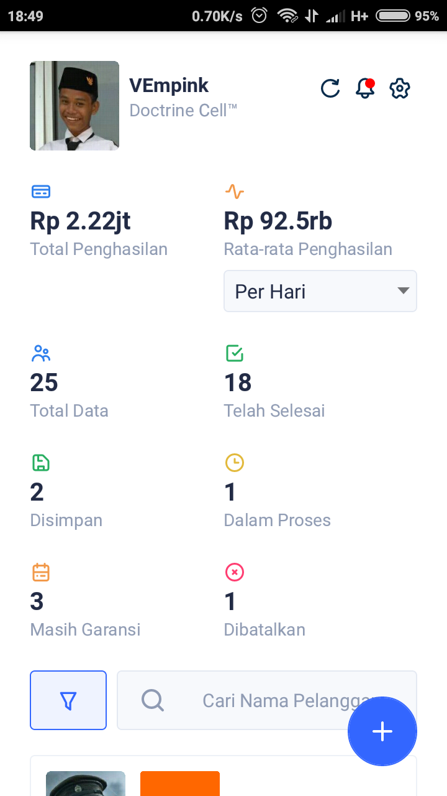
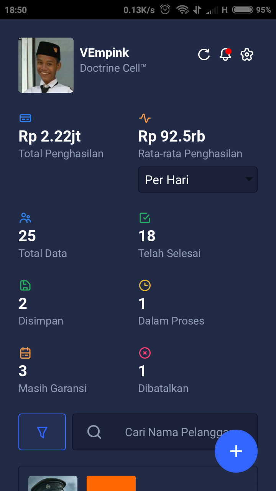
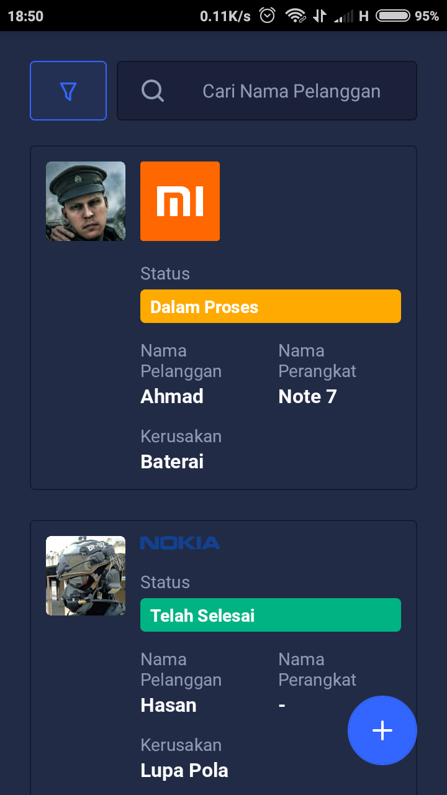
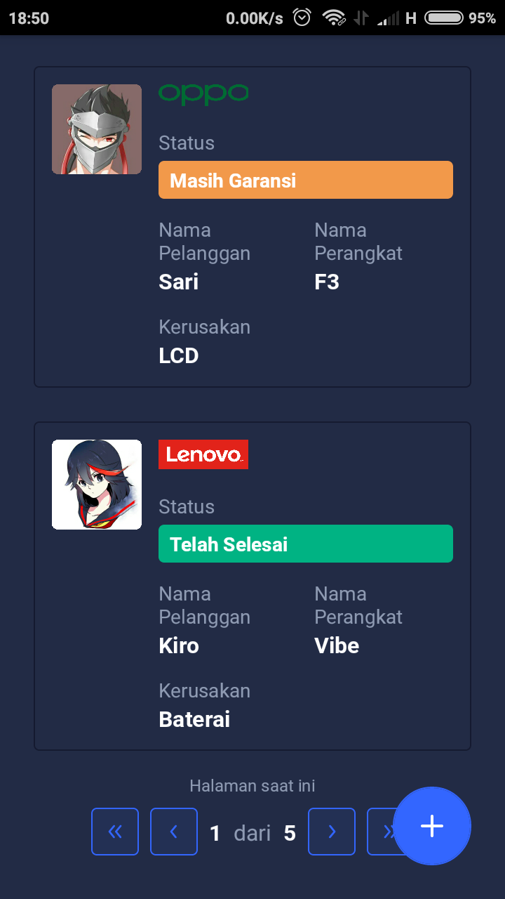
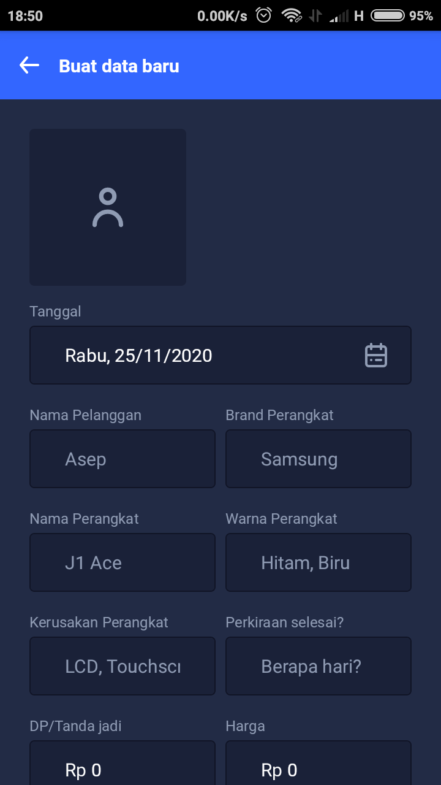
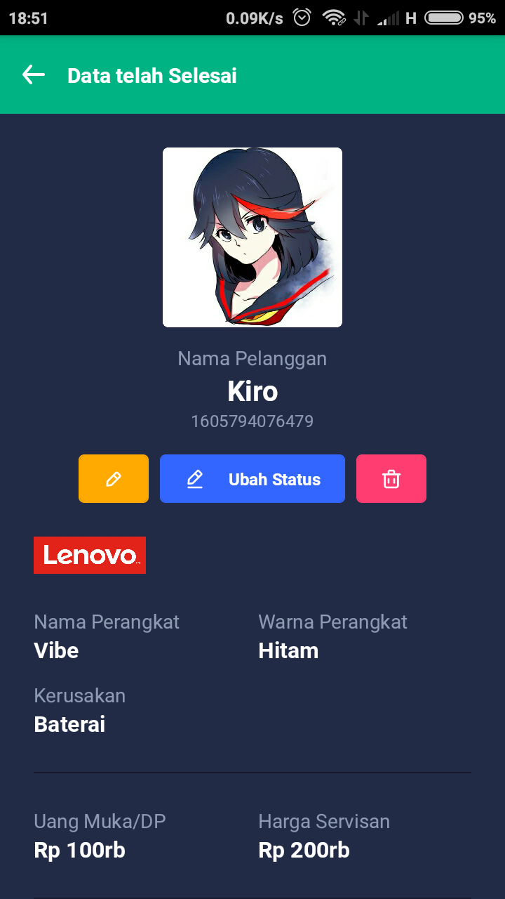

### Restronic by React Native

Restore, service, and electronic. Applications for Electronic Technicians, especially Cellphone Technicians, which are useful for managing customer data such as adding warranties, estimating completion times, etc.

  
  
  
  

  
  
  

#### Features

- Dark Mode :sunglasses:
- Backup and Restore to Local Storage and Google Drive :file_folder:
- Notifications :bell:
- and more.

#### How to Read File

